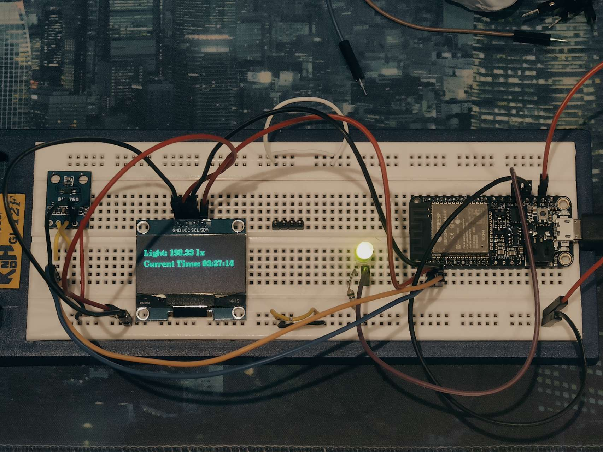

# Board
  Adafruit ESP32 feather

# Material
  ## BH1750 -> light sensor
    param
      - multi mode
      - wide light intensity range
    link
      - https://amzn.asia/d/aXa3jAT
  ## Screen -> display
    param
      - driver: SH1106
      - display Type: OLED
      - size: 128x64
      - color: blue
    link
      - https://amzn.asia/d/6Vz5Vp6
  ## LED -> setup indicator
    description
      - Used to indicate that the programe has setup successfully
    param
      - color: green
    link
      - https://amzn.asia/d/6Vz5Vp6

# Project preview
  - 